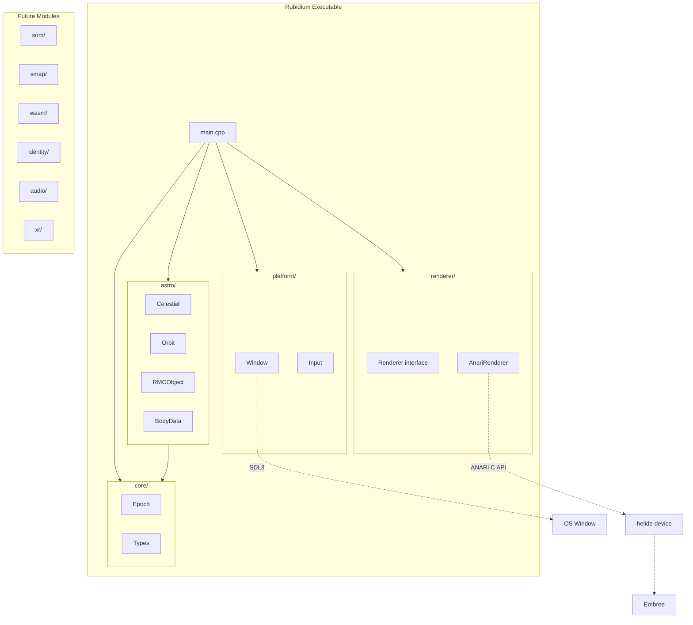

# Rubidium — Phase 1: First Executable of the OMBI Metaverse Browser

## Context

**OMBI** (Open Metaverse Browser Initiative) is the organizational unit under the Metaverse Standards Forum. **Rubidium** is the working name for the browser software itself, analogous to Chromium for web browsers.

Phase 1 proves the architecture by porting the Solar System simulation to C++. The solar system is the first "spatial fabric" Rubidium will render, but the codebase is structured from day one to grow into the full browser.

## What Phase 1 Delivers

A native C++executable that renders the solar system using ANARI. Orbital mechanics run as browser-level C++ (not WASM services). Planet/star data is embedded (not from a fabric). No SOM yet. But the module boundaries are drawn where the full architecture needs them.




## Directory Layout

```
E:\Dev\vcpkg\                                ← shared C++ package manager (NOT in OMBI repo)

E:\Dev\OMBI\                                 ← future git repo root
  .gitignore
  LICENSE                                    ← Apache 2.0
  NOTICE                                     ← attribution for third-party components
  README.md                                  ← project overview, build instructions, license badge
  .cursor\
    rules\
      project.mdc                            ← Cursor rules for the OMBI/Rubidium project
  Project\
    ANARI-SDK\                               ← ANARI built from source (gitignored)
      build\
    Rubidium\
      docs\                                  ← living documentation, updated as features land
        architecture.md                      ← module map, dependency graph, design decisions
        build.md                             ← how to set up the environment and build
        modules\                             ← per-module docs as they mature
          astro.md
          renderer.md
      cpp\
        Source\
          CMakeLists.txt                     ← top-level: project definition, pulls in modules
          src\
            main.cpp                         ← entry point, wires modules together
            core\                            ← foundational types, used by all modules
              Epoch.h / Epoch.cpp            ← J2000 time, Julian dates, tick system
              Types.h                        ← common typedefs (Vec3, Quat, etc.)
            astro\                           ← orbital mechanics (browser-level computation)
              Celestial.h / Celestial.cpp    ← quaternion ops, frame conversions, precession
              Orbit.h / Orbit.cpp            ← Kepler solver, orbital position
              RMCObject.h / RMCObject.cpp    ← body registry, parent/child hierarchy
              BodyData.h / BodyData.cpp      ← static planet/moon/star definitions
            renderer\                        ← rendering abstraction layer
              Renderer.h                     ← abstract interface (what to render, not how)
              AnariRenderer.h / .cpp         ← ANARI/helide implementation
            platform\                        ← OS windowing and input
              Window.h / Window.cpp          ← SDL3 window creation, frame display
              Input.h / Input.cpp            ← mouse/keyboard handling
          build\                             ← CMake build output (gitignored)
```

**Checked into git:** `.gitignore`, `LICENSE`, `NOTICE`, `README.md`, `.cursor/rules/project.mdc`, `docs/`**, `CMakeLists.txt`, all `src/`** code.

**Gitignored:** `**/build/`, `Project/ANARI-SDK/` (cloned third-party), `.vs/`, `*.user`, `*.suo`, `out/`, CMake caches.

**Future modules** (not Phase 1) will be added as peer directories under `src/`:

- `som/` — Scene Object Model
- `smap/` — SMAP driver layer
- `wasm/` — WASM sandbox runtime
- `identity/` — browser-managed identity
- `audio/` — spatial audio mixing
- `xr/` — OpenXR integration

## Build Environment

- **Toolchain:** Visual Studio 2022 Professional (MSVC) at `C:\Program Files\Microsoft Visual Studio\2022\Professional`
- **CMake:** 3.26 bundled with VS (at `...\Common7\IDE\CommonExtensions\Microsoft\CMake\CMake\bin\cmake.exe`)
- **Package manager:** [vcpkg](https://github.com/microsoft/vcpkg) at `E:\Dev\vcpkg` — handles C++ dependency compilation
- **Dependencies via vcpkg:**
  - `embree3` (v3.13.5) — ray tracing kernels needed by helide
  - `sdl3` (v3.4.2) — window display and input
  - `glm` — math library needed by ANARI SDK
- **ANARI SDK** — built from source at `E:\Dev\OMBI\Project\ANARI-SDK` with `-DBUILD_HELIDE_DEVICE=ON`, using vcpkg toolchain so it finds Embree/GLM automatically. The vcpkg `anari` port disables helide, so we build it ourselves to get the CPU ray tracer.

## Execution Plan

### Step 1: Environment setup

1. Clone vcpkg to `E:\Dev\vcpkg`, run `bootstrap-vcpkg.bat`
2. `vcpkg install embree3 sdl3 glm` — builds Embree, SDL3, GLM (10-30 min first time)
3. Clone ANARI-SDK to `E:\Dev\OMBI\Project\ANARI-SDK`
4. Build ANARI from source using vcpkg toolchain:

```
   cd E:\Dev\OMBI\Project\ANARI-SDK
   cmake -B build -DCMAKE_TOOLCHAIN_FILE=E:/Dev/vcpkg/scripts/buildsystems/vcpkg.cmake
         -DBUILD_HELIDE_DEVICE=ON -DBUILD_EXAMPLES=ON -DBUILD_CTS=OFF -DBUILD_TESTING=OFF
   cmake --build build --config Release
   

```

1. Run `anariTutorial` from the build to confirm helide renders a PPM image

### Step 2: Project scaffold

Create the OMBI repo structure and Rubidium CMake project.

**Repo-level files:**

- `.gitignore` — excludes `**/build/`, `Project/ANARI-SDK/`, `.vs/`, `*.user`, `*.suo`, `out/`, CMake caches
- `LICENSE` — Apache License, Version 2.0 full text
- `NOTICE` — attribution notices for third-party components (ANARI SDK, Embree, SDL3, GLM)
- `README.md` — project overview (OMBI, Rubidium, OMB architecture), build prerequisites, build steps, license
- `.cursor/rules/project.mdc` — Cursor project rules: OMBI/Rubidium context, architecture reference, module conventions, namespace rules, build instructions

**Apache 2.0 source headers** on every `.h` and `.cpp` file:

```
// Copyright 2026 Metaversal Corporation
//
// Licensed under the Apache License, Version 2.0 (the "License");
// you may not use this file except in compliance with the License.
// You may obtain a copy of the License at
//
//     http://www.apache.org/licenses/LICENSE-2.0
//
// Unless required by applicable law or agreed to in writing, software
// distributed under the License is distributed on an "AS IS" BASIS,
// WITHOUT WARRANTIES OR CONDITIONS OF ANY KIND, either express or implied.
// See the License for the specific language governing permissions and
// limitations under the License.
```

**Rubidium project:**
All C++ code lives in namespace `rubidium` with sub-namespaces per module (`rubidium::core`, `rubidium::astro`, `rubidium::renderer`, `rubidium::platform`).

The top-level `CMakeLists.txt`:

- Sets C++17 minimum
- Uses vcpkg toolchain
- Finds ANARI, SDL3 packages
- Builds a single `Rubidium` executable from all module sources
- Structured so future modules (SOM, SMAP, WASM) can be added as separate static libraries

### Step 3: core + astro modules (port from JS)

Direct translation from the JS source into `rubidium::astro`:

- `**Epoch`** (`core/`) — J2000 reference, Julian date, TT time, tick system (1 tick = 1/64 second)
- `**Types`** (`core/`) — `Vec3`, `Quat`, `Mat3` aliases (plain structs or glm, no engine-specific types)
- `**Celestial`** — quaternion ops, `BuildOrbitalQuat(omega, i, w)`, frame conversions, precession
- `**Orbit`** (extends Celestial) — orbital elements, `SolveKepler()`, `PositionAtTick()`, `ComputeOrbital()`
- `**RMCObject`** — body registry, parent/child tree, physical properties, composed `Orbit`, `ComputeRaw()`
- `**BodyData`** — static definitions for ~50-80 bodies (star, planets, moons)

Key algorithm (`Orbit::PositionAtTick`):

1. Mean anomaly from tmStart + tmNow modulo tmPeriod
2. Solve Kepler's equation (Newton iteration, tol 1e-15)
3. Ellipse point: `x = a*(cosE - e)`, `y = b*sinE`
4. Rotate by orbit quaternion x precession quaternion
5. Return position in meters

### Step 4: renderer module

Abstract interface + ANARI implementation:

- `**Renderer`** (pure virtual) — `Initialize()`, `BeginFrame()`, `SubmitSpheres()`, `SubmitCurves()`, `SetCamera()`, `EndFrame()`, `GetFrameBuffer()`. No ANARI types leak into this interface.
- `**AnariRenderer`** — implements `Renderer` using the ANARI C API + helide device. Uses `ANARI_GEOMETRY_SPHERE` for bodies, `ANARI_GEOMETRY_CURVE` for orbit paths. Creates world, light, camera internally.

This separation means a future GPU-accelerated ANARI device (or an entirely different rendering backend) requires zero changes outside `renderer/`.

### Step 5: platform module

- `**Window`** — SDL3 window creation, pixel buffer presentation (receives frame buffer from renderer, blits to screen)
- `**Input`** — mouse drag for camera orbit, scroll for zoom, keyboard for time controls

### Step 6: main loop (wire it all together)

```cpp
auto window = rubidium::platform::Window(1280, 720, "Rubidium");
auto renderer = rubidium::renderer::AnariRenderer();
auto bodies = rubidium::astro::CreateSolarSystem();
auto epoch = rubidium::core::Epoch();

while (window.IsOpen()) {
    window.PollEvents();
    epoch.Advance();
    for (auto& body : bodies) body.ComputeRaw(epoch);
    renderer.BeginFrame();
    renderer.SetCamera(camera);
    renderer.SubmitSpheres(bodies);
    renderer.SubmitCurves(orbits);
    renderer.EndFrame();
    window.Present(renderer.GetFrameBuffer());
}
```

## Design Principles

- **No leaky abstractions.** Module boundaries are hard. `astro/` never includes ANARI headers. `renderer/` never includes SDL3 headers. `main.cpp` is the only place that knows all modules.
- **Namespace everything.** All code in `rubidium::` with module sub-namespaces. No global symbols.
- **Prepare for concurrency.** Data structures should be read/write separable even if Phase 1 is single-threaded, because SYCL parallelism is coming.
- **Own the math.** `core/Types.h` defines the canonical vector/quaternion types. Modules use these, not renderer-specific or library-specific types.

## What Phase 1 Proves

- ANARI can render a real scene with real data through its abstraction layer
- The OMB's "abstract objects, not GPU calls" principle works in practice
- Orbital mechanics (browser-level computation) perform correctly in C++
- The helide backend renders without the application knowing anything about Embree or ray tracing internals
- The module structure can accommodate the full OMB architecture

## Future Phases

- **Phase 2:** Introduce `som/` module — move body data into a Scene Object Model with ownership and hierarchy
- **Phase 3:** Introduce `smap/` module — obtain body data from a spatial fabric via SMAP
- **Phase 4:** Introduce SYCL — parallel orbital computation (matters at scale)
- **Phase 5:** Introduce `xr/` module — OpenXR for VR (replacing the current WebXR path)
- **Phase 6:** Introduce `wasm/` module — sandboxed service execution
- **Phase 7:** Visual polish — trails, labels, overlays, time controls, interaction

## Risk: Build Time

With vcpkg handling dependencies, the main risk is reduced to:

- **vcpkg initial build** of Embree + SDL3 (10-30 minutes, compiles from source)
- **ANARI SDK build** with helide (~5 minutes once Embree is ready)

After the environment is up, the code port is mechanical — the math translates line-for-line. Phase 1 should be achievable in a focused session.