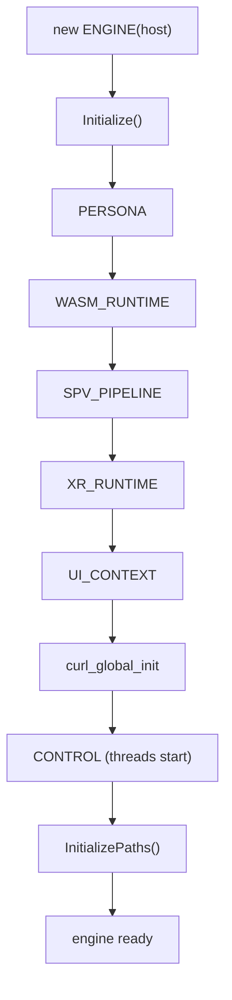
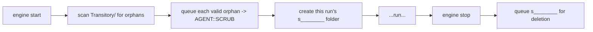

# Lifecycle

[Architecture Overview](overview.md) showed the ownership tree as a static picture. This
page shows it in motion: how the tree is **built up** at startup, how **sessions** are
opened and closed within it, how it is **torn down** at shutdown, and how the engine's
**on-disk cache** is laid out so that transient session data can be cleaned up reliably —
including after a crash. If you are embedding Sneeze, this is the page that tells you the
order of operations you are signing up for.

One principle governs everything here, and it is worth stating before any detail:
**initialization and shutdown are exact mirrors.** Whatever order the engine brings
subsystems up in, it tears them down in the precise reverse. This *symmetry* is treated
as non-negotiable in the codebase (see [Conventions](conventions.md)), because it is what
makes failure handling and teardown predictable.

---

## Why it works this way

Two recurring patterns explain almost every lifecycle decision in the engine.

**Nested initialization, reverse-order shutdown.** Each subsystem is initialized *inside*
the success of the previous one. If any step fails, only the subsystems that already came
up are shut down, in reverse order — nothing half-initialized is ever touched. In code
this appears as deeply nested `if (subsystem->Initialize())` blocks, and as destructors
that `delete` members in the reverse of construction order. The benefit is that there is
exactly one correct teardown path and the compiler/structure enforces it.

**Add before init, remove after shutdown.** When the engine manages a list of owned
children (contexts, and lower down, fabrics and nodes), it adds the child to the list
*before* calling `Initialize`, and removes it *after* teardown. The child must be visible
to other threads during both its initialization and its destruction — for example, the
compositor must be able to see a viewport while that viewport's renderer is being torn
down, to service the thread-affinity handshake. This is a universal invariant.

---

## Engine startup

The host constructs an `ENGINE`, passing its `IENGINE` implementation, then calls
`Initialize()`. Construction does almost nothing; `Initialize()` does the real work, and
it can fail (returning `false`) — the host must check.

`Initialize()` reads configuration from the host (`sAppDataPath()` is required) and then
brings up the engine-level subsystems in a fixed nested order:

1. **`PERSONA`** — the local identity proxy is created first.
2. **`WASM_RUNTIME`** — the sandbox runtime.
3. **`SPV_PIPELINE`** — SPIR-V validation.
4. **`XR_RUNTIME`** — XR device access (initializes cleanly even with no headset present).
5. **`UI_CONTEXT`** — the UI toolkit.
6. **curl global init** — the HTTP stack (a true process-global, initialized once here).
7. **`CONTROL`** — the engine thread, agent pools, and metronome start spinning.
8. **Path initialization** — the on-disk cache layout is created (below).

Only if every step succeeds does `Initialize()` set its internal initialized flag and
return `true`. Each failure logs a specific message and leaves the engine un-initialized,
and the destructor will unwind only what was actually created.



---

## Sessions: opening and closing a context

With the engine running, the host opens a **context** to start a browsing session:

```cpp
CONTEXT* pContext = pEngine->Context_Open (pIContext, sUrl, kSession);
```

`Context_Open` takes the host's `ICONTEXT` (for inspector callbacks), an optional initial
URL, and a **session type**. It does four things, in order:

1. Creates a fresh **temporary folder** for the session (a viewport-scoped transitory
   directory — see [cache layout](#on-disk-cache-layout)).
2. Chooses the context's **permanent path** based on session type: a persistent session
   uses the engine's persistent cache root; a transitory session uses the engine's
   session folder, so nothing it stores outlives the run.
3. Constructs the `CONTEXT`, **adds it to the engine's context list** (add-before-init),
   then calls `CONTEXT::Initialize(sUrl)`.
4. On failure, removes the context from the list, deletes it, and queues its temporary
   folder for cleanup.

Inside `CONTEXT::Initialize`, the per-session subsystems come up in their own nested
order — **`CONSOLE` → `NETWORK` → `STORAGE` → `SCENE` → `VIEWPORT`** — and the scene's
`Initialize(sUrl)` is what begins loading the first fabric. The order matters: the console
exists before anything that might log to it, the network exists before the scene that
fetches through it, and the viewport (which renders the scene) comes last.

Closing is the mirror. `Context_Close` captures the session's temporary path, deletes the
context (which runs the reverse-order subsystem teardown), removes it from the list, and
queues the temporary folder for cleanup. Deleting the context's `SCENE` triggers a
cascade: the root fabric's nodes are recursively destroyed, each attachment node closes
the fabric attached to it, and each fabric closes its container — so by the time the scene
is gone, the session's containers have been released too. Any containers still registered
are then deleted explicitly.

> **Navigation within a session.** A live context can be re-pointed without being closed.
> `CONTEXT::Url(sUrl)` deactivates the viewport, deletes the current scene (the full
> teardown cascade), builds a new scene for the new address, and reactivates the viewport.
> `CONTEXT::Reload()` does the same for the current address. Both take an optional reset
> flag intended to also clear cached data. See [their pitfalls](#current-limitations).

---

## Engine shutdown

Destroying the `ENGINE` reverses startup exactly:

1. Close every still-open context (the engine drains its context list).
2. Queue the engine's own session folder for cleanup.
3. Delete `CONTROL` (joins the engine thread and all agents).
4. curl global cleanup.
5. Delete `UI_CONTEXT`, `XR_RUNTIME`, `SPV_PIPELINE`, `WASM_RUNTIME` — reverse of init.
6. Delete `PERSONA`.

Each `delete` is paired with the `new` that created it, in mirror order. Threads are
joined (via `CONTROL`) before the members those threads might still touch are destroyed —
see [Threading](threading.md) for why join-before-destroy is load-bearing.

---

## On-disk cache layout

The engine stores everything under the host-provided application-data path, in a
`Sneeze/Cache` subtree split into two roots:

```text
<sAppDataPath>/Sneeze/Cache/
├── Persistent/              data that survives across runs (persistent sessions)
└── Transitory/              session-scoped data, deleted when the session ends
    ├── s________            one per engine run   ("s" + 8 hex chars)
    └── v________            one per context      ("v" + 8 hex chars)
```

- A **persistent** session keeps its network cache and storage under `Persistent/`, so it
  is available next run.
- A **transitory** session keeps everything under the engine's per-run session folder
  (`s` + 8 hex), which is deleted on shutdown — the foundation of a private / "ephemeral"
  browsing mode.
- Each context also gets its own **temporary** folder (`v` + 8 hex) for genuinely
  short-lived data, deleted when the context closes.

**Crash-safe cleanup.** Transient folders are deleted by a background cleanup agent
(`AGENT::SCRUB`), not inline. On startup, before creating the new run's session folder,
the engine **scans the `Transitory/` root for orphans** — folders left behind by a
previous run that crashed or was killed — and queues each for deletion. Every path is
validated twice (its parent must be `Transitory`, and its leaf must match the `s`/`v` +
8-hex pattern) before anything is removed, so a bug or bad input can never point the
scrubber at an arbitrary directory. All filesystem calls use error codes rather than
exceptions, so a path failure degrades gracefully instead of crashing the engine.



---

## Current limitations

- **Navigation versus rendering is not yet synchronized.** `CONTEXT::Url` / `Reload`
  delete the live scene while the compositor may be traversing it, which is a known
  hazard during active rendering. The deactivation step reduces but does not fully close
  this window, and in-flight fetches for the old scene are not cancelled. This is
  acknowledged future work.
- **The reset flag is a stub.** The `bReset` parameter on `Initialize` / `Url` / `Reload`
  is plumbed through but the cache-clearing behavior it implies is not yet implemented.
- **Teardown does not yet gracefully quiesce running modules.** Shutdown deletes stores
  (and thus instances) but does not first run the per-instance close/shutdown handshake
  that the full design calls for. See the [WASM system](../systems/wasm.md).

---

## See also

- [Architecture Overview](overview.md) — the ownership tree these lifecycles build.
- [Fabric Loading](fabric-loading.md) — what `SCENE::Initialize(sUrl)` sets in motion.
- [Threading Model](threading.md) — why threads are joined before members are destroyed.
- [Engine system](../systems/engine.md) and [Context system](../systems/context.md).
- [API: ENGINE](../api/sneeze/ENGINE.md), [API: CONTEXT](../api/context/CONTEXT.md).

---

[Home](../Home.md) · Prev: [Architecture Overview](overview.md) · Next: [Fabric Loading](fabric-loading.md)
