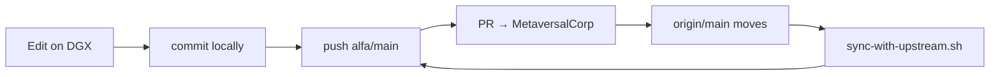

# Fork sync with MetaversalCorp canonical

**Canonical upstream:** [MetaversalCorp/Sneeze](https://github.com/MetaversalCorp/Sneeze) (`origin`)

**Your publish fork:** [AlfaOmegaGrafx/Sneeze](https://github.com/AlfaOmegaGrafx/Sneeze) (`alfa`)

DGX and agent pushes land on **alfa** first. Open a pull request into MetaversalCorp when ready. PRs may not merge immediately — or at all — so the fork can sit **several commits ahead** while canonical keeps moving. A plain `git pull --ff-only origin main` **will fail** in that state.

## Safe sync (merge, do not rebase)

```bash
./scripts/sync-with-upstream.sh
```

This script:

1. Fetches `origin` (MetaversalCorp) and `alfa` (your fork)
2. Reports how many commits you are **ahead** and **behind** canonical
3. **Fast-forwards** when you are only behind
4. **Merges** `origin/main` when you are both ahead and behind — preserving fork-only commits (no rebase; rebasing rewrites history already pushed to alfa)
5. Runs **continuity checks** (key paths, `bash -n` on build scripts, optional incremental build + `SneezeTest --wasm --net` if `libSneeze.a` exists)

Push the merged result to your fork after checks pass:

```bash
./scripts/sync-with-upstream.sh --push-fork
```

Dry run (ahead/behind only):

```bash
./scripts/sync-with-upstream.sh --dry-run
```

## Typical workflow



| Step | Command |
|------|---------|
| Publish fork work | `git push alfa main` |
| Pull canonical without losing fork commits | `./scripts/sync-with-upstream.sh` |
| Sync + push fork | `./scripts/sync-with-upstream.sh --push-fork` |
| After MetaversalCorp merges your PR | `git fetch origin && git merge --ff-only origin/main` |

## If merge conflicts happen

1. Resolve conflicts in the working tree (prefer **canonical** for upstream refactors; re-apply **fork** hunks for DGX-only scripts/docs).
2. `git add` resolved files, `git commit` (merge commit).
3. Re-run `./scripts/sync-with-upstream.sh` (continuity checks).
4. `./scripts/build-linux.sh` or `./scripts/build-dgx-spark.sh` on DGX when C++ changed.

**Do not** `git rebase origin/main` after pushing to alfa — it rewrites commits and complicates PRs.

## DGX build script

`./scripts/build-dgx-spark.sh` calls `sync-with-upstream.sh` before building so incremental DGX rebuilds stay compatible with canonical updates even when the fork is ahead.

---

[Contributing](contributing.md) · [Guides](index.md) · [Home](../Home.md)
