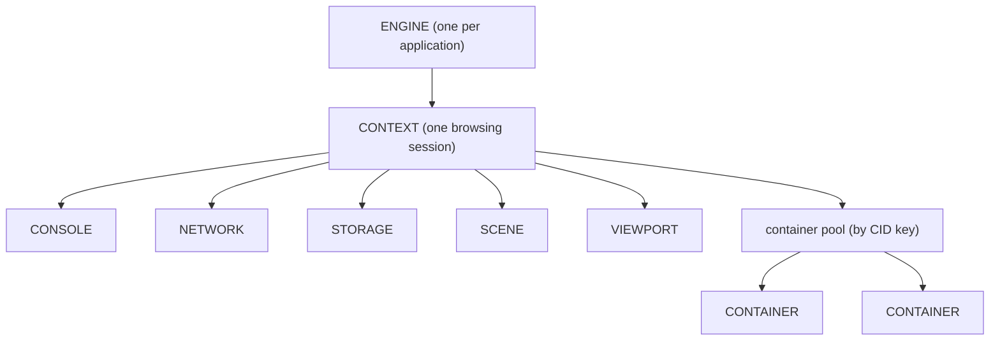
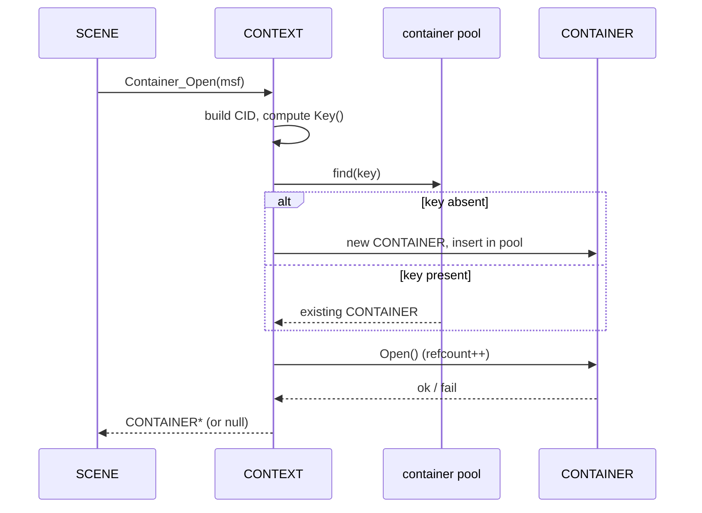

# Context System

A `CONTEXT` is one browsing session — the engine's equivalent of a browser tab. It is the boundary inside which an address is loaded, a world is built, and frames are drawn, and it is the owner of every per-session subsystem that does that work. If the [engine](engine.md) is the application-wide singleton, a context is the unit you open and close as the user moves between independent sessions. This page explains what a context owns, the strict order in which it stands those subsystems up and tears them down, where its files live on disk, and how it pools the [containers](container.md) that give content its runtime identity.

The exact class and method signatures are in the [Context API reference](../api/context/index.md); this page is about how and why the system works.

---

## Why it exists

The engine has to support more than one independent session at a time, and each session has to be self-contained: its own scene, its own network cache, its own storage, its own console output, its own rendering surface. Two tabs pointed at two different worlds must not share scene state or leak one source's data into the other.

At the same time, every one of those subsystems needs the same small set of things — a back-pointer to the session they belong to, a way to reach the engine, somewhere on disk to keep their files. Rather than wire each subsystem to the engine individually, the engine creates one `CONTEXT` per session and lets the context own and coordinate the rest. A context is therefore both a *scope* (everything inside one session) and a *hub* (the single object through which those subsystems reach each other and the engine).

The host application never constructs a context directly. It calls [`ENGINE::Context_Open`](../api/sneeze/index.md), passing an `ICONTEXT` host interface, an optional start URL, and a session kind; the engine constructs the `CONTEXT`, initializes it, and hands it back. Closing is the mirror: `ENGINE::Context_Close` destroys it.

---

## What a context owns

A context owns five per-session subsystems, each created once during initialization and destroyed once during teardown:

- **[`CONSOLE`](../api/console/index.md)** — the developer console; collects log output, organized into per-source streams.
- **[`NETWORK`](../api/network/index.md)** — resource fetching and the on-disk cache.
- **[`STORAGE`](../api/storage/index.md)** — persistent per-source JSON document storage.
- **[`SCENE`](../api/scene/index.md)** — the scene object model: the tree of fabrics, nodes, and map objects that represents the loaded world.
- **[`VIEWPORT`](../api/viewport/index.md)** — the rendering surface and camera that turns the scene into frames.

It additionally owns a pool of **[`CONTAINER`](container.md)** objects — the runtime identities and sandboxes of the signed sources loaded into the scene. Containers are not created up front; they come and go as fabrics load and unload, and the context pools them so the same source loaded twice shares one container (see [Container pooling](#container-pooling)).

Every subsystem holds a back-pointer to its context and reaches everything else through it. A node that needs the network asks its scene for the context and the context for the network; nothing caches a private copy. This keeps ownership unambiguous: the context owns the subsystems, and the subsystems borrow each other through the context.

---

## Session kinds

A context is opened as one of two session kinds, declared by `CONTEXT::eSESSION`:

- **`kSESSION_PERSISTENT`** — a session whose cache and storage are meant to survive across runs.
- **`kSESSION_TRANSITORY`** — a session whose data is meant to be discarded.

The kind is recorded on the context and informs where its files live and whether they persist. The two on-disk locations are passed in at construction as `Path_Permanent` (durable per-session data) and `Path_Temporary` (scratch and cache), derived by the engine from its own persistent and session paths. Subsystems that write to disk — `NETWORK`'s cache, `STORAGE`'s documents — anchor themselves under these paths.

---

## Initialization order and reverse teardown

The defining discipline of a context is **symmetry**: subsystems come up in a fixed order, and go down in the exact reverse. The order is not arbitrary — each subsystem depends on the ones before it.

`CONTEXT::Initialize(sUrl, bReset)` builds the subsystems in this order, and only proceeds to the next if the previous one initialized successfully:

1. **`CONSOLE`** — first, so every later subsystem has somewhere to log.
2. **`NETWORK`** — next, so anything that fetches can fetch (the `bReset` flag asks the network layer to start from a clean cache).
3. **`STORAGE`** — persistent document storage.
4. **`SCENE`** — created and immediately told to `Initialize(sUrl)`, which begins the asynchronous load of the world at the start address.
5. **`VIEWPORT`** — last, so there is a scene to render the moment it activates.

If any step fails, the context reports the failure and stops; the half-built context is then destroyed, unwinding whatever was created.

Teardown, in the destructor, is the mirror image:

1. Delete the **`VIEWPORT`** (stop rendering first).
2. Delete the **`SCENE`**. This triggers a cascade: the root fabric's nodes are recursively deleted, every attachment-point node deletes the fabric attached to it, and each fabric, on destruction, closes its container — decrementing that container's reference count. By the time the scene is gone, every container the scene was using has been released.
3. Delete any **`CONTAINER`** objects still held in the pool. After the scene cascade these should all be at zero references; deleting them frees the pooled identities.
4. Delete the **`STORAGE`**.
5. Delete the **`NETWORK`**.
6. Delete the **`CONSOLE`** — last, so everything above it could log while shutting down.

This reverse order is load-bearing. The scene must be gone before its containers are freed; storage and network must outlive the scene that uses them; the console must outlive everyone who logs.

---

## Navigation

Once a context is live, three methods move it around — all of which rebuild the scene rather than mutating it in place:

- **`Url(sUrl, bReset)`** — navigate to a new address. The context deactivates the viewport, deletes the current scene (running the full teardown cascade described above), constructs a fresh `SCENE`, initializes it at the new URL, and reactivates the viewport on the same host surface. Navigation is thus a destroy-and-rebuild, not an in-place edit.
- **`Reload(bReset)`** — re-navigate to the *current* address. It reads the root fabric's URL, copies it (the fabric is about to be destroyed), and calls `Url` with that copy.
- **`Logout()`** — clears the network layer's state (`NETWORK::Clear`), discarding session-bound fetched data without rebuilding the scene.

The `bReset` flag, threaded through `Initialize`, `Url`, and `Reload`, requests a clean start that bypasses cached data.

> The container pool is intentionally **not** cleared on navigation. Containers > survive a `Url`/`Reload` so that returning to a source does not re-establish its > identity from scratch; they are only freed when the context itself is destroyed.

---

## Container pooling

When the scene loads a signed source, it asks the context to open a container for that source's verified [MSF](msf.md): `CONTEXT::Container_Open(pMsf)`. The context does not blindly create a new container each time — it **pools** them, so two fabrics from the same source under the same identity share one container.

The pooling key is the source's identity. The context builds a [`CONTAINER::CID`](../api/container/CID.md) — the identity record — from the MSF's fingerprint, organization, container name, and the current persona's hash, and assigns a trust level from the MSF's signature and certificate-chain checks. The CID's `Key()` collapses those fields into a single string. The context keeps an `unordered_map` from that key string to the owning `CONTAINER*`; this map is the authoritative owner of every container in the session.

`Container_Open` then:

1. Builds the `CID` and computes its key.
2. Looks the key up in the pool. If absent, it constructs a new `CONTAINER` and inserts it; if present, it reuses the existing one.
3. Calls `CONTAINER::Open()`, which reference-counts the container and brings up its per-container resources on the first open.
4. If `Open()` fails, removes the entry and deletes the container, returning null.

The root fabric is a special case: it has no MSF, so the context builds a synthetic "Root" CID at trust level `kTRUST_ROOT`.

`Container_Close(pContainer)` is the inverse for a single reference — it calls `CONTAINER::Close()`, decrementing the refcount and tearing down the container's resources when the count reaches zero. The pool entry itself remains until the context is destroyed; a closed-but-pooled container is simply re-opened if its source loads again.

For what a container *is* and what `Open`/`Close` actually stand up and tear down, see the [Container system](container.md).

---

## Threading model

A context is touched from multiple threads: the engine control thread that opens and closes it, network fetch threads that deliver data into its scene and storage, and the render thread driving its viewport.

The context's own synchronization is narrow. The **container pool is guarded by a recursive mutex** (`m_mxContainer`), held by `Container_Open` and `Container_Close`. It is recursive because closing a container can, through the scene teardown cascade, re-enter the pool's locked paths on the same thread. The map lookup, insertion, and erase all happen under this lock, so concurrent `Container_Open` calls from different fetch completions are serialized.

The five owned subsystems each carry their own internal locking appropriate to their job (the scene's recursive registry lock, the network's fetch synchronization, and so on); the context does not lock around calls into them. The accessor methods (`Scene()`, `Network()`, …) return the owned pointers without locking — they are stable for the life of the context between `Initialize` and destruction, with the exception that **`Scene()` changes during navigation**: `Url`/`Reload` delete and replace the scene pointer, so a pointer captured before navigation dangles afterward.

---

## Current limitations

These come straight from the code and shape how the system behaves today.

- **Navigation is not render-synchronized.** `Url` deletes the scene and builds a new one while only deactivating and reactivating the viewport around it. There is no coordination with an in-progress render-thread traversal beyond that, and outstanding fetches into the old scene are not cancelled. Navigating during active loads is a known hazard (see [Scene → Current limitations](scene.md#current-limitations)).

- **The container pool is never pruned during a session.** Containers are only freed when the context is destroyed. The code that would clear the pool on navigation is present but commented out, so a long-lived session that visits many sources accumulates their containers until it closes.

- **Trust level is currently forced.** After computing a container's trust from the MSF's signature and chain checks, `Container_Open` unconditionally overrides the result to `kTRUST_EXPIRED`. This is an in-progress override, not the intended trust policy; the verification logic that precedes it is the design, and the override is expected to be removed. See [Container → Trust levels](container.md#trust-levels).

---

## See also

- [Context API reference](../api/context/index.md) — exact `CONTEXT` signatures.
- [Container](container.md) — what `Container_Open` pools, and the `CID` identity.
- [Engine](engine.md) — opens and closes contexts (`Context_Open` / `Context_Close`).
- [Scene](scene.md) — the world a context builds and rebuilds on navigation.

---

[Systems index](index.md) · Prev: [Control](control.md) · Next: [Container](container.md)
