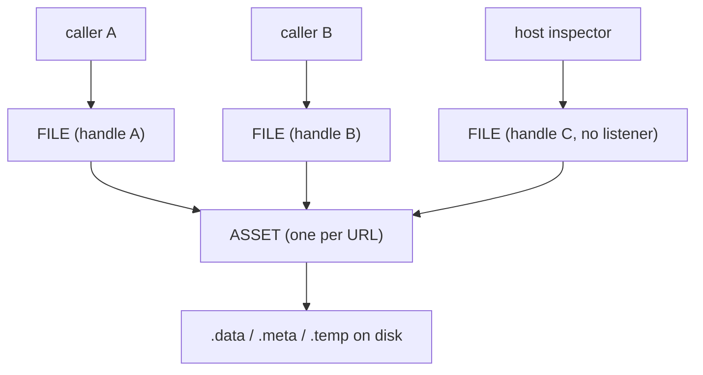
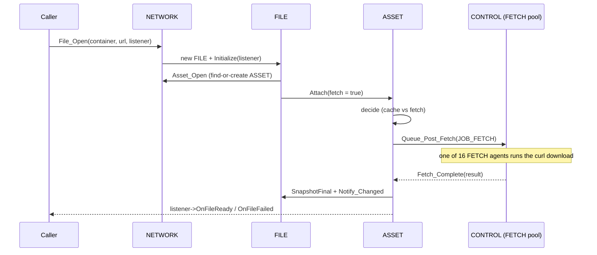

# Network System

The network system is the engine's resource loader and on-disk cache. Every byte that arrives from outside the engine — the signed file that describes a fabric, the WebAssembly modules a source ships, the textures a node paints itself with — comes through here. This page explains why the system is shaped the way it is, the two cooperating object types at its core, how a fetch travels from request to callback, and the concurrency hazards that dominate its design.

It assumes you have read [Core Concepts](../overview/core-concepts.md). The exact class and method signatures are in the [Network API reference](../api/network/index.md); this page is about how and why the system works.

---

## Why it exists

Content in the open metaverse is fetched from many independent sources, and the same resource is often wanted by several parts of the engine at once. A naive "download this URL" call would re-fetch the same bytes repeatedly, block whoever asked, lose everything on restart, and trust whatever came back. The network system exists to turn raw fetching into something the rest of the engine can lean on. It must:

- **fetch without blocking** — requests are issued on background threads and the caller is notified when the result is ready,
- **cache to disk and survive restarts** — a resource fetched once is served from disk next time, even after the process exits,
- **deduplicate** — many callers asking for one URL share a single download and a single cached copy,
- **verify integrity** — a caller can demand that the bytes match a cryptographic hash before they are accepted,
- **stay inspectable** — a host's developer tools can watch every request, including ones that have already completed.

These requirements pull in different directions — sharing demands one object per URL, while per-caller notification and inspection demand one object per request. The system resolves the tension with two distinct types.

---

## The two core types: FILE and ASSET

### FILE — the per-caller handle

A `FILE` is what a caller gets back when it asks for a resource. It is a handle: one per `File_Open` call, owned by the network system but handed out as a raw pointer. Each caller that wants a URL opens its own `FILE`, registers an optional listener on it, reads the bytes through it when they arrive, and closes it when done.

Crucially, a `FILE` carries a **snapshot** of the resource's display-level fields — state, URL, hash, size, HTTP status, timing, content type. The snapshot is copied from the shared asset at well-defined moments, so the handle can still report what happened *after* it has detached from the underlying data. This is what lets a developer inspector keep showing a completed request long after the bytes were consumed.

### ASSET — the private, shared, one-per-URL state

An `ASSET` is the network system's private internal class — never exposed to callers, declared only in the module's private header. There is exactly **one ASSET per cached resource**, keyed by the resource's on-disk pathname (which is derived from the URL). All the `FILE` handles for the same URL point at the same `ASSET`. The asset owns the real shared state: the current fetch state, the in-flight fetch job, the cached bytes on disk, the response headers, and the `.meta` sidecar bookkeeping.

The split is the whole design. **FILE is per-request and per-caller; ASSET is per-resource and shared.** Deduplication, caching, and the actual fetch live on the asset; notification, inspection, and lifetime-from-the-caller's-view live on the file.



---

## The two-counter ASSET lifecycle

An asset's life is governed by **two independent reference counts**, and understanding them is the key to understanding the system.

- **`m_nCount_Open`** counts how many `FILE` handles *reference* the asset structurally. It rises in `Open` (called from `File_Open` via `Asset_Open`) and falls in `Close`. When it reaches zero the asset is removed from the live asset map and deleted. This counter answers "does anyone still hold this asset?"

- **`m_nCount_Attach`** counts how many handles are *actively engaged* with the asset's data — the ones that want it fetched and loaded. It rises in `Attach` and falls in `Detach`. The first attach (`0 → 1`) loads the `.meta` sidecar from disk; the last detach (`1 → 0`) flushes the sidecar back to disk and evicts the asset's in-memory fields. This counter answers "does anyone still want this data live?"

The separation matters because a handle can exist without engaging — a **passive open** (no listener) creates the asset and bumps `m_nCount_Open` but does not attach, so it neither triggers a fetch nor loads the sidecar. An inspector enumerating history holds files this way.

### Lazy loading

Nothing happens until it is needed. The asset is created on the first `File_Open` for its URL, not before. The `.meta` sidecar — the small JSON file recording what is cached and whether it is still valid — is read from disk only on the first *attach*, not at construction. An asset that is opened passively and never attached never touches the sidecar.

### The attach decision

The heart of the cache logic is `ASSET::Attach`. When a handle attaches with a fetch allowed, the asset inspects its current state, the caller's requested hash, and whether caching is enabled, and decides among: serve the cached bytes, re-fetch because the cache is stale or the hash changed, verify a now-required hash against cached bytes, propagate a prior failure, or start a first fetch. The notable cases:

- **Cached and valid** — served straight from disk; no network traffic.
- **Cached but stale** per a staleness rule — the cached files are discarded and a fresh fetch starts.
- **Cached without a hash, but the caller now supplies one** — the cached bytes are hashed in place; if they match, the hash is adopted and they are served; if not, they are treated as corrupt and re-fetched.
- **Caller's hash differs from the asset's recorded hash** — the content has been revised; re-fetch.
- **Caching disabled for this caller** — a fresh fetch is forced even if cached.
- **Previously failed** — the failure is propagated to this caller too.

---

## Disk layout and the cache key

Every asset maps to three files on disk that share a base pathname:

```text
<base>.data    the cached payload bytes
<base>.temp    the in-flight download (renamed to .data on success)
<base>.meta    a JSON sidecar describing the asset
```

The base pathname fans out by identity and a per-URL key:

```text
<PermanentPath>/<personaHash>/<fp[0:2]>/<fp[2:24]>/<container>/Network/<dk[0:2]>/<dk[2:]>
```

The identity prefix `<personaHash>/<fp[0:2]>/<fp[2:24]>/<container>` is owned by `CONTAINER`; the `Network` segment is the cache's own, and `FILE` builds the leaf on top of `CACHE::Path()` rather than re-deriving identity. The `<fp...>` segments come from the owning [container](container.md)'s certificate fingerprint, and `<dk>` is the **disk key**: a SHA-1 of the URL, truncated to 12 bytes (24 hex characters), with its first two characters peeled off as a fan-out directory so no single directory accumulates too many entries. Keying the path by container means the same URL fetched under two different identities is cached separately — the metaverse browser identifies origins by certificate, not domain.

The `.temp`-then-rename pattern is used everywhere a file is written (payloads, sidecars, `rules.json`): write to a temporary name, then atomically rename over the target, so a crash mid-write never leaves a half-written file in place.

### The `.meta` sidecar

The sidecar records the URL, the accepted hash, the asset index, the byte size, the creation time, the HTTP status, and the request/response headers. On the first attach it is read back to reconstruct a cached asset's state without re-fetching; on the last detach it is rewritten if the asset is `READY` (or removed if the asset `FAILED`). The recorded URL is checked against the requested URL and the `.data` file's existence is confirmed before a sidecar is trusted — a sidecar without its payload is ignored.

### `rules.json` and staleness

A single `rules.json` at the cache root holds two things: a monotonic asset-index counter, and a list of **staleness rules**. A rule pairs an optional content-type with an "older than" ISO-8601 timestamp; an asset is stale if its content-type matches (or the rule's type is blank) and it was created before the rule's cutoff. `NETWORK::Reset` is implemented simply as adding a blanket rule with the current time as the cutoff — instantly marking everything currently cached as stale so the next attach re-fetches it. (Placement of `rules.json` is shared across same-session-type contexts today; making it per-container is an open design item recorded in the code.)

---

## A fetch from request to callback



A fetch is never run on the caller's thread. The asset packages the request as a `JOB_FETCH` and posts it through `INETWORK_IMPL::Queue_Post_Fetch`, which forwards it to the engine and into [CONTROL](control.md)'s dedicated **FETCH pool** — capped at **16 concurrent fetch agents**. Each agent performs a blocking download; overflow requests queue and dispatch as agents free up. When a download finishes, the agent calls back into `ASSET::Fetch_Complete`, which records the result, snapshots and notifies every attached `FILE`, and clears the in-flight job.

### Asynchronous notification, even for cache hits

A subtle but important rule: **completion is always delivered asynchronously**, never inline. Even when a resource is already `READY` or `FAILED` in the cache, the attach path posts a *notify-only* `JOB_FETCH` rather than calling the listener directly. This prevents re-entrancy — a listener firing in the middle of `File_Open` could call back into the network system while it is still setting the request up. The notify-only job sets the asset to `FETCHING` while it is in flight so overlapping requests do not clobber the job pointer, and when it fires, `Fetch_Complete` notifies *every* file attached during the window, not just the original requester. The trade-off is that piggy-backing files inherit the original's timing values — a minor reporting approximation over identical data.

---

## Threading model

Three layers of locking guard three layers of state, plus one atomic flag that resolves the one deadlock the layering would otherwise create.

- **`m_mxNetwork`** (a recursive mutex on `NETWORK::Impl`) guards the asset map, the file history list, and the rules.
- **`m_mxAsset`** (a recursive mutex per `ASSET`) guards an asset's state, counters, attached-file list, and sidecar I/O.
- **`m_mxFile`** (a recursive mutex per `FILE`) guards a file's attach count and pending-deletion flags.

The required lock order is **`m_mxNetwork` before `m_mxAsset`**. `Asset_Open` and `Asset_Close` are called while holding `m_mxNetwork` and then take `m_mxAsset`; file-local attach/detach take only `m_mxAsset`. The orders never invert — except in one place.

### The deadlock, and the guard flag

`Fetch_Complete` runs on a FETCH agent and holds `m_mxAsset` while it notifies listeners. A listener almost always responds by closing its file, and closing a file whose two pending flags are both set must take `m_mxNetwork` to erase it from the history list. That is `m_mxAsset` → `m_mxNetwork` — the reverse of the required order, and a classic deadlock against any thread doing `File_Open` (`m_mxNetwork` → `m_mxAsset`) at that moment.

The fix is a per-file atomic **guard flag** (`m_bGuarded`). Before the notification loop, `Fetch_Complete` arms the guard on each file. If a listener calls `Close` during its callback, the close path sees the armed guard (via an atomic exchange), *defers* — doing nothing — and records that a close was requested by clearing the guard. After the loop, with `m_mxAsset` released, `Fetch_Complete` re-checks each guard and performs the deferred closes with no conflicting lock held. The hazard is confined to exactly the path that needs it, with no change to the lock hierarchy.

### Dual-flag deletion

A `FILE` lives in the history list until two independent one-way gates have both fired:

- **`Pending_Close`** — the *caller* is done with the handle. Set by `FILE::Close`. It detaches the listener and stops further engagement.
- **`Pending_Clear`** — the *inspector* has dismissed the handle from its view. Set by `FILE::Clear` (and by `NETWORK::Clear` sweeping the whole list). It fires the host's "file deleted" notification.

Only when both are set is the `FILE` actually erased and deleted. This lets a caller finish with a resource while the developer tools keep showing it, and lets the tools dismiss a row while a caller still holds the handle — each side releases independently, and the last one out frees the object.

---

## Current limitations

These come straight from the code and its in-progress markers.

- **Shutdown busy-waits for assets to drain.** `NETWORK::Impl`'s destructor deletes any leaked file handles, then spins in a 1 ms sleep loop until the asset map empties. This is a deliberate workaround for a race: a fetch job in flight clears the asset's job pointer before a being-deleted asset can cancel it, so the only safe option is to wait for assets to drain naturally. It assumes the asset code is otherwise correct — a bug that strands an asset would hang shutdown.
- **`rules.json` is shared too widely.** The cache path (and therefore the rules file and the asset-index counter) is shared across all contexts of the same session type, but "clear cache" is conceptually per-tab. A per-container rules file is the intended direction; the open issues (a container appearing in multiple contexts, unreachable not-currently-loaded containers) are documented in the source.
- **Re-fetch can re-notify earlier files.** A second attach with a different hash triggers a re-fetch that will call `OnFileReady` on the first file again; whether to suppress or version-gate that re-notification is undecided (marked `TODO` in the attach logic).
- **Queued-time instrumentation is a stub.** `FetchQueuedTime` is carried through the snapshot pipeline but is never assigned, so queue-duration reporting currently reads zero.
- **The `VALIDATING` state is reserved but unused.** Hash verification happens inline during attach rather than as a distinct state; the current flow is `IDLE → FETCHING → READY`/`FAILED`.

---

## See also

- [Network API reference](../api/network/index.md) — exact `NETWORK`, `FILE`, `IFILE` signatures.
- [Scene](scene.md) — the largest consumer: MSF, WASM, and texture fetches.
- [Storage](storage.md) — the sibling per-context persistence subsystem (documents, not fetched bytes).
- [Control](control.md) — the FETCH pool that runs downloads off the calling thread.
- [Container](container.md) — supplies the identity that keys an asset's disk path.

---

[Systems index](index.md) · Prev: [Scene](scene.md) · Next: [Storage](storage.md)
