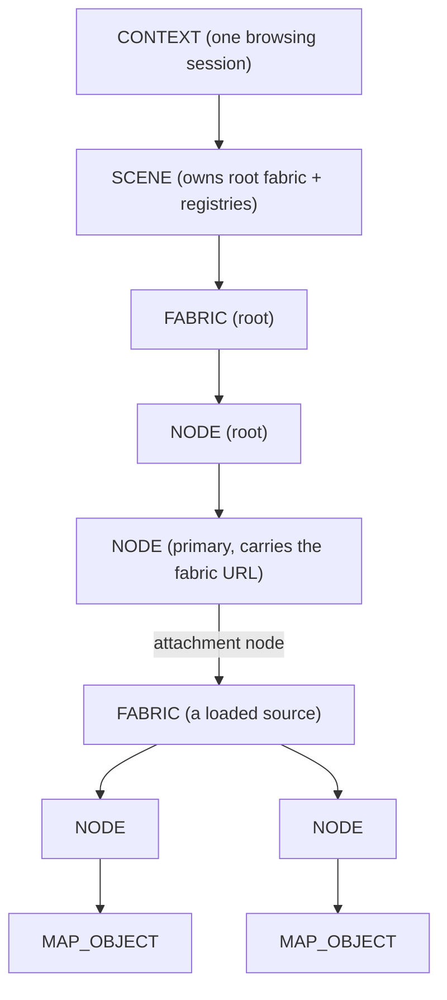
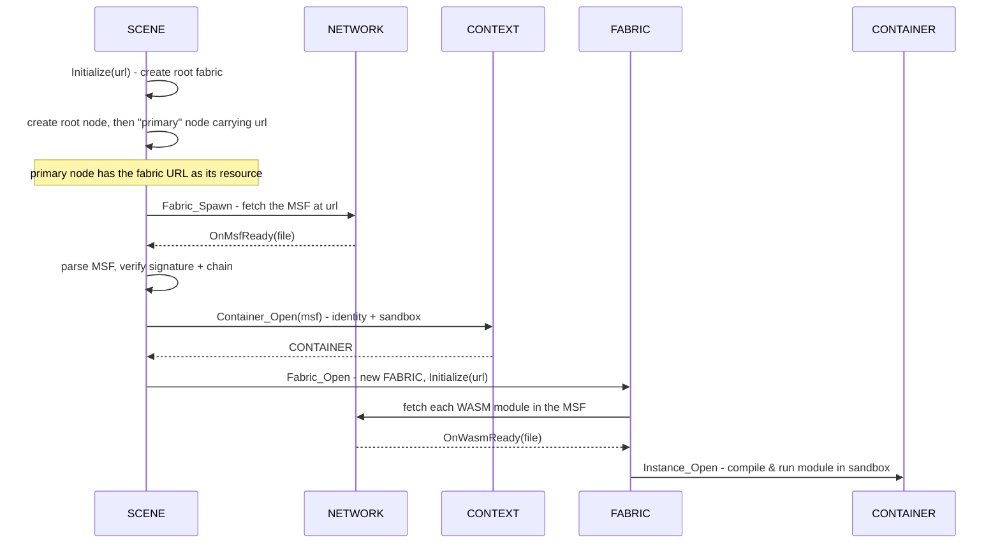

# Scene System

The scene system is the engine's model of the world — the data structure that holds everything currently being rendered, and the machinery that loads it from the network. If you think of the engine as a metaverse browser's rendering core, the scene system is its document model: the equivalent of the DOM in a web browser. This page explains what that model looks like, how a network address becomes a populated scene, who owns what, and where the sharp edges currently are.

It assumes you have read [Core Concepts](../overview/core-concepts.md). The exact class and method signatures are in the [Scene API reference](../api/scene/index.md); this page is about how and why the system works.

---

## Why it exists

Content in the open metaverse arrives as code from many independent sources, all of which want to put things into the same shared world. The engine needs one authoritative, in-memory representation of "everything in the scene right now" that:

- the renderer can walk to produce frames,
- sandboxed content code can mutate to add, move, and remove objects,
- can be assembled from *multiple* sources at once, each isolated from the others,
- and can be torn down and rebuilt when the user navigates somewhere new.

That representation is the **scene object model**, or SOM. The scene system implements it with three cooperating classes — `SCENE`, `FABRIC`, and `NODE` — plus a payload type, `MAP_OBJECT`, that carries the actual 3D properties.

---

## The three structural classes

### NODE — a single element in the tree

A `NODE` is one element of the scene graph: a point in the tree that may have a parent and any number of children. A node by itself has no geometry; it points to a `MAP_OBJECT` that carries the spatial and visual data (position, orientation, scale, bounding volume, appearance, and an optional texture). Separating the two means the tree structure and the renderable payload can evolve independently.

Each node has a 48-bit **object index** that identifies it. Children are held in a `std::vector<NODE*>`. A node also remembers its parent, the fabric it belongs to, and — if it is an *attachment point* — the child fabric attached to it (more on this below). Nodes use the pimpl idiom: the public `NODE` class is a thin handle and all state lives in a private `NODE::Impl`.

### FABRIC — one source's branch of the tree

A `FABRIC` represents one spatial fabric's contribution to the scene: a branch of the overall tree, rooted at a single node (`Node_Root()`). Every fabric is tied to exactly one [container](container.md) — the runtime identity and sandbox of the signed source that owns it — and to the [MSF](msf.md) file that described it.

Fabrics form their own hierarchy that mirrors the node tree. When one fabric's content attaches another fabric, the attaching node in the parent fabric becomes the new fabric's **attachment node** (`Node_Attach()`), and the two fabrics are linked parent-to-child. This is how content from one source can host content from another: a node in fabric A serves as the mount point for fabric B.

A fabric is also where a source's **WebAssembly modules** are loaded. When a fabric is initialized from an MSF, it fetches each module the MSF declares and opens it as a WASM instance inside its container. The fabric owns those instances for its lifetime and closes them when it is destroyed.

### SCENE — the root and the registry

A `SCENE` is the top of the model, owned one-per-[context](context.md) (one per browsing session). It owns the **root fabric** — the structural anchor of the whole tree — and acts as the central registry for everything in the scene. Two registries live on the scene:

- a **fabric table** (`m_umpFabric`) mapping each fabric's index to its `FABRIC*`, and
- a **node handle table** (`m_umpNode`) mapping each node's object index to its `NODE*`, alongside a flat list of every `MAP_OBJECT` (`m_apMap_Object`).

The node handle table is *scene-global*: object indices are unique across the entire scene, not per-fabric. This matters for how content code addresses nodes, and is discussed under [Object indices](#object-indices-and-the-handle-table).

### MAP_OBJECT — the renderable payload

A `MAP_OBJECT` holds everything spatial about a thing in the world: its name, type, transform (position, rotation, scale), an optional orbit, a bounding volume, material-like properties, and an optional decoded texture. It is a base class with derived types for different object categories (`MAP_OBJECT_ROOT`, `MAP_OBJECT_CELESTIAL`, `MAP_OBJECT_TERRESTRIAL`, `MAP_OBJECT_PHYSICAL`). The renderer reads map objects to draw the scene; content code populates them.

> Current behavior worth knowing: when the scene creates a node it presently > instantiates the map object as `MAP_OBJECT_CELESTIAL` regardless of the declared > type. This reflects the engine's current stage and is expected to generalize as > more object categories come online.

---

## How the pieces relate

The defining structural fact is that any node can reach the entire engine through a short, fixed chain of owner pointers. There are no cached shortcuts — one path to everything:

```text
NODE  ->  FABRIC  ->  SCENE  ->  CONTEXT  ->  ENGINE / NETWORK / VIEWPORT
```

So a node that needs to fetch a texture asks its fabric for the scene, asks the scene for the network, and issues the request — without holding a network pointer of its own. This keeps ownership unambiguous: each object knows only its owner, and reaches everything else through it.



---

## Object indices and the handle table

Sandboxed content code does not hold raw C++ pointers — it cannot, since it runs in an isolated WebAssembly sandbox. Instead it refers to nodes by **object index**: a 48-bit number stored in a 64-bit word, where the upper 16 bits may carry a class discriminator and the low 48 bits are the index itself. The scene's node handle table translates an object index into the real `NODE*` on the host side. This is the same pattern an operating system uses with file descriptors: hand untrusted code a number, keep the real object behind a table you control.

The scene allocates indices in `Node_Create`. A few reserved values steer the behavior, defined in `Scene.h`:

- `OBJECTIX_IDENTITY` (all bits set) means "assign me the next free index." The scene hands out a fresh monotonically increasing index.
- A specific in-range index means "create me at exactly this index." The scene honors it if free, and refuses (returns a null index) if it is already taken.
- `OBJECTIX_NULL` and `OBJECTIX_ERROR` are the failure signals returned to callers.

The handle table is what makes nodes addressable, lifetime-managed, and safe to expose to untrusted code. Creating a node inserts it into the table and appends its map object to the flat list; closing a node removes both and deletes them.

---

## Loading a fabric: from URL to live scene

This is the heart of the system. Walking it end to end shows how every class plays its part. The flow is entirely asynchronous — network fetches happen on background threads and call back into the scene when they complete.



Step by step:

1. **Bootstrap.** `SCENE::Initialize(url)` creates the root fabric (a fabric with no MSF and no attachment), then creates two nodes: a root node, and a *primary node* whose map object carries the requested URL as its resource reference (marked with a sentinel subtype). The scene remembers this primary node.

2. **Spawn.** Creating the primary node runs `NODE::Initialize`, which notices the sentinel subtype and the non-empty URL and calls `SCENE::Fabric_Spawn`. This is the bridge from "a node that names a fabric" to "go load that fabric." Spawn opens a network file for the URL, using the root fabric's container, and registers a callback.

3. **MSF ready.** When the file arrives, `OnMsfReady` reads the bytes, constructs an [MSF](msf.md) object, parses it, and verifies its signature and certificate chain. This is the trust gate: nothing is loaded from an MSF that fails to parse.

4. **Container.** The scene asks the context to open a `CONTAINER` for the verified MSF. The container is the source's runtime identity and sandbox; the context deduplicates and reference-counts containers so the same source loaded twice shares one. See [Container](container.md) and [Trust & Isolation](../architecture/trust-and-isolation.md).

5. **Fabric open.** `Fabric_Open` allocates a scene-global fabric index, constructs a `FABRIC` bound to the container and the attachment node, registers it in the fabric table, and calls `FABRIC::Initialize`.

6. **Modules.** `FABRIC::Initialize` reads the module list from the MSF and starts a network fetch for each `.wasm` module. As each arrives, the fabric opens it as a WASM instance in its container. When the last module resolves, the fabric is fully live and its code can begin building the scene through the host functions.

Textures follow the same asynchronous pattern at the node level: when a node's map object names a texture resource (rather than a fabric), `NODE::Initialize` requests it from the network, and on completion the node decodes the image and stores the pixels on the map object for the renderer.

For the cross-subsystem view of this flow — including where trust decisions and deduplication happen — see [Fabric Loading](../architecture/fabric-loading.md).

---

## Navigation and teardown

Navigating to a new address is `SCENE::Url(newUrl)`. It is brutally simple: destroy the entire root fabric, then rebuild it for the new URL. Destroying the root fabric triggers a **cascade**: deleting a node recursively deletes its children, and when a node is an attachment point, the fabric attached to it is deleted too. By the time the root fabric is gone, every descendant fabric — including all loaded sources — has been torn down, every container reference released, and every map object freed.

This cascade is the symmetric mirror of the loading flow: loading attaches fabrics to nodes and opens containers and instances; teardown closes instances, closes containers, and detaches fabrics, in reverse.

---

## Threading

The scene is touched from multiple threads: the engine's control thread, network fetch threads delivering MSF and WASM and texture data, and the rendering thread walking the tree. The system protects its shared state with a recursive mutex, `m_mxScene`, held while the fabric table and node handle table are mutated (`Fabric_Open`/`Fabric_Close`/`Fabric_Find`, `Node_Root`/`Node_Open`/`Node_Close`). Within a node, the child vector has its own mutex, and a map object's texture pixels are guarded by a texture mutex so the decode thread and the renderer never race.

Each node also carries a `SEQLOCK` — a sequence lock — intended to let the renderer read a node's fast-changing transform without blocking the writer that updates it.

---

## Current limitations

These are documented honestly because they shape how the system behaves today. They come straight from the code and its in-progress markers.

- **In-flight fetches are not cancellable.** If a node is destroyed (for example by navigating away) while its MSF or texture fetch is still outstanding, the pending callback still holds the node's address. Cancellation on teardown is planned but not yet implemented; until then, navigation during active loads is a known hazard.

- **Teardown can race the renderer.** `SCENE::Url` tears down and rebuilds the tree without coordinating with the rendering thread that may be walking it. A shared read guard (or a scene revision scheme) is the intended fix; today the scene signals the viewport to invalidate as a stopgap.

- **Fabric handles are not lifetime-guarded.** `Fabric_Find` returns a `FABRIC*` under the lock, but nothing prevents that fabric from being closed while a caller still holds the pointer. A capture/release reference scheme is anticipated for host calls that look fabrics up by index.

- **Duplicate-index ambiguity across fabrics.** Because the node handle table is scene-global, loading the same MSF into multiple fabrics under one container can collide on template node indices. The resolution depends on a planned distinction between WASM-managed and map-managed fabrics.

---

## See also

- [Scene API reference](../api/scene/index.md) — exact `SCENE`, `FABRIC`, and `NODE` signatures.
- [Container](container.md) — the identity and sandbox each fabric is bound to.
- [Network](network.md) — how MSF, module, and texture fetches are performed and cached.
- [MSF](msf.md) — the signed file format a fabric is described by.
- [Fabric Loading](../architecture/fabric-loading.md) — the same flow across subsystem boundaries.

---

[Systems index](index.md) · Next: [Network](network.md)
