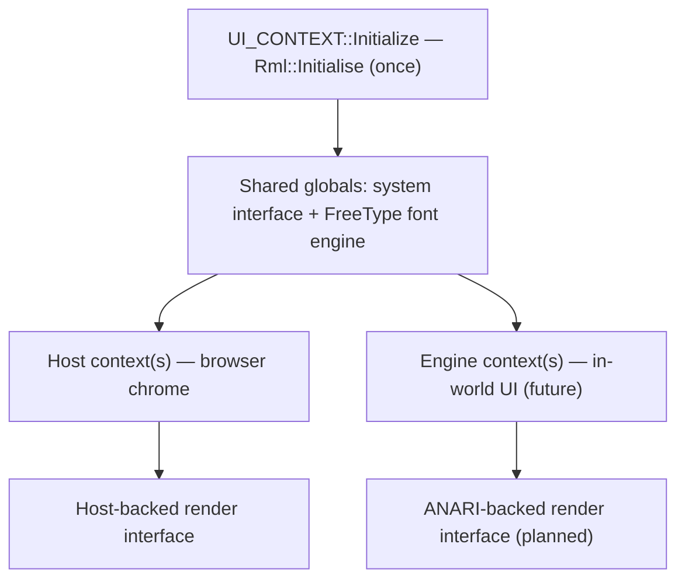

# UI System

The UI system gives the engine a retained-mode HTML/CSS toolkit. Two very
different parties need to draw user interface in a metaverse browser: content
sources want to put panels and overlays *inside the world*, and the host
application wants its own *chrome* — the bar, menus, and inspector that frame the
view. Both want to describe that interface in the familiar, declarative language
of HTML and CSS rather than hand-placing pixels. This page explains why the
engine standardizes on one such toolkit, how `UI_CONTEXT` brings it up, the
two-sided context model it enables, and why nothing is drawn on screen yet.

It wraps **RmlUi** 6.2 (an HTML/CSS retained-mode UI library) with **FreeType**
for font rasterization. The class lives in namespace `SNEEZE::DEP` and its eventual
rendering path runs through the [Viewport](viewport.md).

---

## Why it exists

A 3D world is not enough on its own; people interact with it through 2D surfaces
— a service's control panel floating in space, a settings dialog, a heads-up
readout — and authors expect to build those the way they build web pages, with
markup and stylesheets. **RmlUi** is a retained-mode UI toolkit that speaks a
subset of HTML and CSS: "retained-mode" means the application hands the library a
document and the library keeps and manages that tree, laying it out and updating
it, rather than the application redrawing everything every frame.

Choosing one shared toolkit solves the problem from both directions at once. The
host application can render its own chrome with it, and content can describe
in-world UI with it, using the same engine, the same layout rules, and the same
fonts. The UI system's job is to own that toolkit's single global lifecycle and
the shared services every UI document needs — a clock, a logging sink, and a font
engine — so that both sides can stand their own interfaces up on top.

---

## What UI_CONTEXT is

`UI_CONTEXT` is a small lifecycle owner. It is created by the [engine](engine.md)
during startup (last among the dependency wrappers, after the XR runtime), holds
just an `ENGINE*` and an initialized flag, and exists to bracket RmlUi's global
init and shutdown.

`Initialize(ENGINE*)` does three things and then starts the library. It records
the engine, installs a **system interface** and a **render interface** (described
below) as RmlUi's global singletons, and calls `Rml::Initialise()`. On success
it logs the RmlUi version (noting it is running the stub renderer); on failure it
logs an error and reports not-initialized. The destructor is the exact mirror:
if initialization succeeded, it calls `Rml::Shutdown()`.

Two interfaces are the contract RmlUi requires an embedder to provide, and
`UI_CONTEXT` supplies a minimal version of each:

- **The system interface** (`STUB_SYSTEM`) answers the two things RmlUi needs
  from its host: elapsed time, which it derives from a steady clock captured at
  construction, and logging, which it maps from RmlUi's log levels onto the
  engine's own `Log` and tags as `UI_CONTEXT`. This interface is fully
  functional.
- **The render interface** (`STUB_RENDER`) is where the library would issue draw
  calls — compiling and rendering geometry, loading and generating textures,
  setting scissor regions. Today every one of those methods is a **stub**: they
  satisfy RmlUi's pure-virtual contract so the library links and initializes, but
  they draw nothing. Geometry and texture calls return placeholder handles and
  the rest are no-ops.

RmlUi's default font engine, backed by **FreeType**, comes up as part of
`Rml::Initialise`, so text layout and font handling are available even while
pixels are not yet produced.

Both interfaces are process-global singletons (held as static instances), which
matters for the model below: there is exactly one system interface and one font
engine shared across every UI document in the process.

---

## The two-sided context model

`Rml::Initialise` is called **once**, by the engine, but a running browser needs
more than one independent UI surface. RmlUi separates global initialization from
individual `Rml::Context` objects: each context is one self-contained UI surface
with its own document tree, and — importantly — each context can be given its own
render interface. That separation is what lets two different parties share one
library without sharing one screen surface.

- The **host application** creates its own context(s) for chrome — the URL bar,
  menus, an inspector — backed by a render interface tied to its windowing layer.
- The **engine** creates context(s) for *in-world* UI: service-provided HTML/CSS
  overlays rendered into the 3D scene. The intended backing here is an
  ANARI-driven render interface that draws the UI through the engine's rendering
  pipeline and into the scene object model.

The shared globals — the system interface and the FreeType font engine — serve
both sides, so timekeeping, logging, and fonts are consistent everywhere while
each context decides for itself how its pixels reach a surface. Because Sneeze is
an engine and not a browser, it ships the in-world half; a host supplies its own
chrome half on top.

---

## Threading

`UI_CONTEXT` is initialized and shut down on the engine's startup and teardown
path, and RmlUi's global state — the system interface, render interface, and font
engine it registers — is process-wide. The class adds no locking of its own;
RmlUi expects its contexts to be driven from a consistent thread, and the
single-initialize / single-shutdown bracketing keeps the global state's lifetime
unambiguous.

---

## Current limitations

Straight from the current code.

- **The renderer is a stub.** `STUB_RENDER` implements RmlUi's render interface
  with placeholder handles and no-ops, so the library initializes, lays out
  documents, and manages state, but produces no pixels. The comment in the code
  is explicit: real rendering arrives when RmlUi is wired to ANARI through the
  scene object model.

- **No engine-side contexts yet.** `UI_CONTEXT` brings the library up but does
  not itself create any `Rml::Context` or load any document. The in-world UI
  surfaces the model anticipates are not yet instantiated.

- **One global system interface.** The system interface and font engine are
  process-wide singletons. That is by design for shared services, but it means
  there is a single timekeeping and logging sink for all UI in the process.

---

## See also

- [Viewport](viewport.md) — the rendering pipeline the in-world render interface will draw through (via ANARI).
- [Scene](scene.md) — the scene object model that in-world UI overlays attach into.
- [Engine](engine.md) — constructs `UI_CONTEXT` during startup and owns its lifetime.

---

[Systems index](index.md) · Previous: [XR](xr.md) · Next: [Persona](persona.md)
