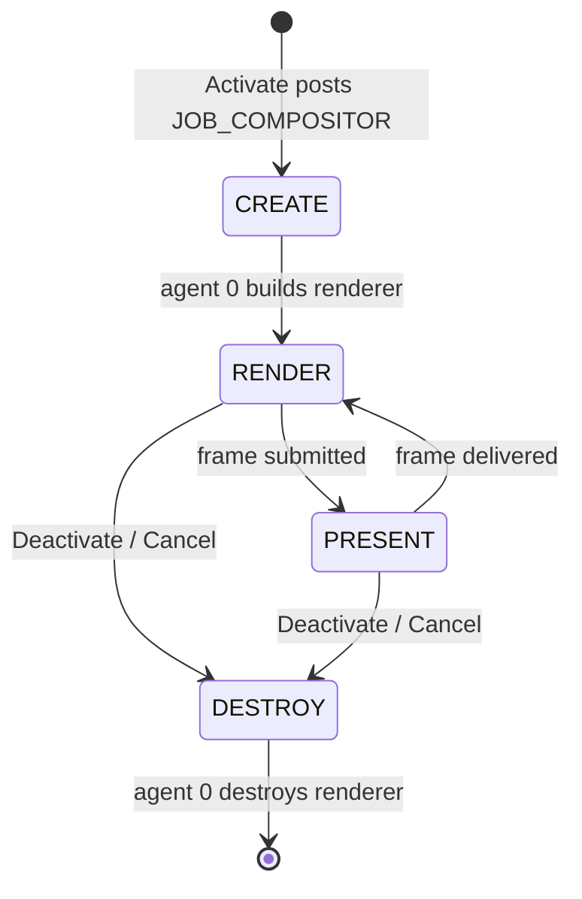

# Viewport System

The viewport system is the engine's window onto the world — the surface that
turns a live [scene](scene.md) into pixels and an orbiting camera the user can
drive. Where the scene system is the document model, the viewport is the
renderer plus the camera plus the plumbing that hands finished frames back to
the host application. This page explains why rendering is structured around a
deferred, single-thread-affine renderer, how a viewport is activated and driven
frame by frame, the two ways a frame reaches the screen, and where the sharp
edges are.

It assumes you have read [Core Concepts](../overview/core-concepts.md). For the
exact class and method signatures, see the [Viewport API reference](../api/viewport/index.md);
this page is about how and why the system works.

---

## Why it exists

The engine renders through **ANARI** — an industry-standard rendering
*abstraction* in which you describe a scene (spheres, curves, a camera, lights)
rather than issue GPU calls. ANARI is backed here by a concrete device built on
a PBR engine. That backend imposes two hard facts that the entire viewport
design bends around:

- **Thread affinity.** The renderer must be *created, used, and destroyed on one
  single thread*. Calling it from multiple threads, or even creating it on one
  thread and tearing it down on another, crashes. The engine therefore cannot
  build the renderer wherever a viewport happens to be constructed; it must
  defer creation onto a dedicated rendering thread.
- **Per-viewport vsync cost.** The backend's swapchain blocks each frame on the
  display's vsync. With multiple viewports rendered one after another on a single
  thread, that wait multiplies. The architecture has to keep rendering off the
  application's threads and account for this cost.

A `VIEWPORT` exists to wrap those constraints in a clean, host-facing object: the
host hands the viewport raw input and a place to draw, and receives finished
frames — without ever touching ANARI, the rendering thread, or the scene graph
directly. One `VIEWPORT` is owned per [context](context.md); the *scene* it
draws is owned by the context and merely *delegated* to the viewport (the
viewport reaches it through `Scene()`), so an inactive tab can keep its scene
without paying for a renderer.

---

## Concepts and vocabulary

The system is one public class with two nested public helpers, one private
renderer hierarchy, and a control-layer job.

### VIEWPORT — the host-facing surface

`VIEWPORT` is the public object. It is a pimpl handle: all state lives in a
private `VIEWPORT::Impl`. It owns the renderer (once created), the accumulated
input state, the readback framebuffer, the camera, and per-frame timing
counters. It only renders while a **host** — an `IVIEWPORT` implementation
supplied by the application — is attached; with no host attached the viewport is
dormant, which is how inactive tabs cost nothing.

### IVIEWPORT — the host's side of the contract

`IVIEWPORT` is the small interface the application implements (declared with the
engine's public interfaces). It exposes three things the renderer needs from the
host: `FrameWindow()` — an optional native window handle to draw directly into;
`FrameSize(w, h)` — the current drawable size, returning whether it changed; and
`OnFrameReady(pixels, w, h)` — the callback the engine invokes to deliver a
finished frame when rendering offscreen.

### VIEW — the orbit camera

`VIEWPORT::VIEW` is a small public struct holding spherical orbit state: two
angles (`m_dTheta`, `m_dPhi`), a `m_dDistance`, and a look-at target. Its
`Update` method folds one frame of mouse and scroll input into those values
(left-drag orbits, scroll zooms, clamped to sane limits). The compositor converts
the spherical state to a Cartesian eye position each frame.

### INPUT — accumulated input

`VIEWPORT::INPUT` is a plain struct of accumulated input deltas: mouse movement,
scroll, button state, and a few key flags. The host pushes into it from its
event thread; the renderer drains it once per frame.

### RENDERER — the abstract rendering backend

`VIEWPORT::RENDERER` is an abstract interface (forward-declared in the public
header, defined privately) describing a frame: set the camera, begin, submit
spheres and curves, end, then read back the framebuffer. Its only concrete
implementation today is the ANARI backend, `RENDERER::ANARI`. See the
[RENDERER reference](../api/viewport/RENDERER.md) for the interface in detail.

### JOB_COMPOSITOR — the render loop unit

Rendering does not run on the host's threads. It runs on the engine's
**compositor pool** ([control system](control.md)), driven by a `JOB_COMPOSITOR`
— a small state machine the viewport posts when it activates. This is the bridge
that satisfies thread affinity.

---

## Activation and the deferred renderer

Constructing a `VIEWPORT` does almost nothing — `Initialize()` just returns true.
Nothing renders, and crucially the renderer is **not** created yet, because the
constructing thread is not the rendering thread. The real work starts at
`Activate(pHost)`:

1. `Activate` records the host and creates a `JOB_COMPOSITOR` for this viewport,
   posting it to the compositor pool (`Queue_Post_Compositor`, which routes to
   `POOL_CYCLE`).
2. The job begins in the **create** state. The compositor pool routes create (and
   destroy) jobs *exclusively to agent 0* — the one designated lifecycle thread —
   so the renderer is born on the thread that will use and later destroy it.
3. On agent 0, the create step queries the host's frame size, resizes the
   viewport to match, and calls `VIEWPORT::Renderer_Initialize()`. That method
   reads the renderer-library name from the engine host, constructs a
   `RENDERER::ANARI`, hands it the host's native window if there is one, and
   initializes it. On success the job advances to the **render** state.

Teardown is the exact mirror. `Deactivate()` cancels the job, which flips it to
the **destroy** state and *blocks until the renderer has actually been destroyed*
on agent 0 (`Renderer_Shutdown()`), then deletes the job and clears the host.
Because creation and destruction are both pinned to agent 0, the affinity
constraint is never violated.

---

## The per-frame loop

Once a viewport's job reaches the render state it cycles **render → present →
render** continuously on the compositor pool. The work splits across two job
steps.

**Render step.** The compositor:

1. Re-checks the host frame size and resizes the viewport and renderer if it
   changed.
2. Drains accumulated input with `Input_Consume()` and feeds it to the camera
   (`VIEW::Update`), then converts the orbit state into an ANARI camera
   (eye/direction/up, an FOV scaled to the viewport height, aspect, near/far).
3. Walks the scene. It reaches the scene through the viewport
   (`Scene()` → `Fabric_Root()` → `Node_Root()`) and recursively traverses the
   node tree, accumulating world-space transforms and producing two flat lists:
   spheres (for celestial surfaces, optionally textured) and curves (orbit
   trails). Traversal follows fabric attachments, so content mounted by other
   sources is drawn too.
4. Consumes a pending scene-invalidation request (see below) and, if set, tells
   the renderer to rebuild from scratch.
5. Runs the frame: `BeginFrame` → `SubmitSpheres` → `SubmitCurves` → `EndFrame`.
6. Advances the job to the present step.

**Present step.** How the frame reaches the screen depends on the rendering path
(next section). When offscreen, the compositor publishes the pixels and invokes
the host's `OnFrameReady`. It then records timing diagnostics and returns the job
to the render step for the next frame.

Throughout, each phase is timed and folded into per-viewport accumulators
(`Accumulate`), and once per second `Diagnostics()` logs an averaged breakdown
(frame, input, scene, submit, render, publish milliseconds) to the engine log.

---

## Two paths to the screen: native surface vs. readback

The renderer can deliver a frame two ways, chosen at initialization by whether
the host provides a native window and whether the backend advertises native-
surface support.

- **Native surface path.** If the host returns a window handle from
  `FrameWindow()` and the device advertises the native-surface extension, the
  renderer draws *directly* into a swapchain on that window. There are zero CPU
  copies and no handoff: the present step does nothing, because the GPU has
  already put the frame on screen. `IsRenderingToNativeSurface()` returns true.
- **Readback path.** Otherwise the renderer draws to an offscreen ANARI
  framebuffer and maps the pixels back to CPU memory after each frame. The
  present step copies those pixels into the viewport's own framebuffer
  (`FrameBuffer_Write`), captures them under a lock (`FrameBuffer_Capture`),
  hands them to the host via `OnFrameReady`, and releases the lock
  (`FrameBuffer_Release`). The host then presents them however it likes (for
  example, blitting through its own windowing layer).

The framebuffer handoff is a deliberate producer/consumer guarded by a mutex:
`FrameBuffer_Capture` *acquires* the lock and returns the pixel pointer;
`FrameBuffer_Release` *releases* it. The host must call them as a pair around its
read, and must not retain the pointer past the release.

---

## Scene invalidation

The renderer retains its ANARI scene across frames and only refreshes transforms
and positions on a normal frame, for speed. That is wrong when the *structure*
of the world changes — most importantly when navigation swaps the entire scene
(`SCENE::Url` tears down and rebuilds the tree). A stale retained scene would
keep drawing objects that no longer exist.

The fix is a cross-thread one-shot flag. Any thread (typically the scene on the
host/control side) calls `VIEWPORT::Scene_Invalidate()`, which sets an atomic
boolean. Before each frame the compositor calls `Scene_Invalidate_Consume()`, an
atomic test-and-clear; if it was set, the compositor calls the renderer's
`InvalidateScene()`, which marks the retained scene dirty so the next `EndFrame`
releases and rebuilds it from scratch. The renderer also rebuilds on its own when
it detects a structural change (different sphere/curve counts, or a sphere
gaining or losing a texture).

---

## Threading model

The viewport's whole reason for existing is to keep rendering on the right
thread, so its threading rules are central, not incidental.

- **The renderer lives only on the compositor pool, and its lifecycle only on
  agent 0.** `Renderer_Initialize` and `Renderer_Shutdown` run on agent 0; all
  ANARI calls (camera, submit, frame, readback) run on the compositor pool. No
  other thread touches the renderer.
- **Host-facing setters are thread-safe and lock-light.** `Activate`/`Deactivate`
  take a viewport mutex. `Input_Mouse`/`Input_Key`/`Input_Consume` share an input
  mutex; the host writes input from its event thread while the compositor drains
  it. The framebuffer has its own mutex held across the capture/release pair.
- **Scene invalidation is lock-free**, carried by a single atomic boolean set on
  one thread and test-and-cleared on the compositor.
- **`Deactivate` blocks.** Cancelling the job waits on a condition variable until
  agent 0 confirms the renderer is destroyed, guaranteeing no frame is in flight
  against a freed renderer when `Deactivate` returns.

---

## Current limitations

These come straight from the code and its in-progress markers.

- **Per-viewport vsync multiplies.** The backend's Vulkan swapchain hardcodes a
  vsync-blocking present mode, and the wait is baked into each frame's render
  call. With N viewports rendered sequentially on the compositor, total frame
  time is roughly N × one vsync interval. Mitigations (a non-blocking present
  mode, an offscreen-only path for background viewports, or a hybrid) are noted in
  the renderer source but not yet implemented.
- **Single lifecycle thread.** Because the backend exposes no thread-transfer
  API, *all* renderer create/destroy work is funneled through compositor agent 0.
  This serializes viewport activation and teardown.
- **`UpdateScene` ignores non-structural content changes.** The fast per-frame
  update path refreshes only transforms and curve positions; changes to colors or
  materials on an otherwise-unchanged structure are not picked up until a full
  rebuild is triggered (by a structural change or an explicit invalidation).
- **Orbit trails render as lit tubes.** Curve geometry is drawn as
  physically-based tubes with an emissive term; a dedicated unlit/emissive
  material and camera-distance radius scaling are anticipated.

---

## See also

- [Viewport API reference](../api/viewport/index.md) — exact `VIEWPORT`,
  `VIEW`, `INPUT`, and `RENDERER` signatures.
- [Scene](scene.md) — the model the viewport renders; owned by the context and
  delegated to the viewport.
- [Control](control.md) — the compositor pool and `JOB_COMPOSITOR` that drive the
  render loop.
- [Context](context.md) — the owner of both the viewport and the scene.

---

[Systems index](index.md) · Prev: [Console](console.md) · Next: [MSF](msf.md)
